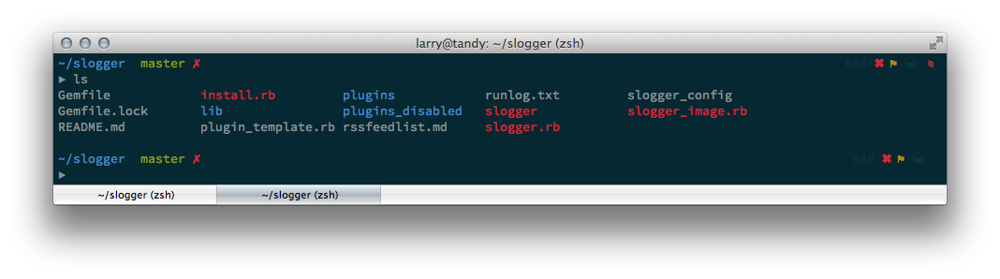
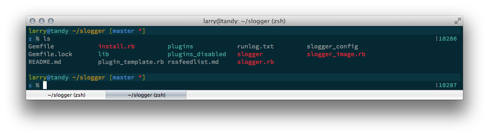
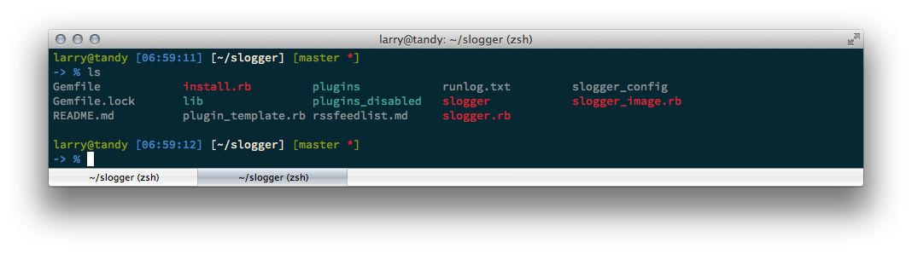
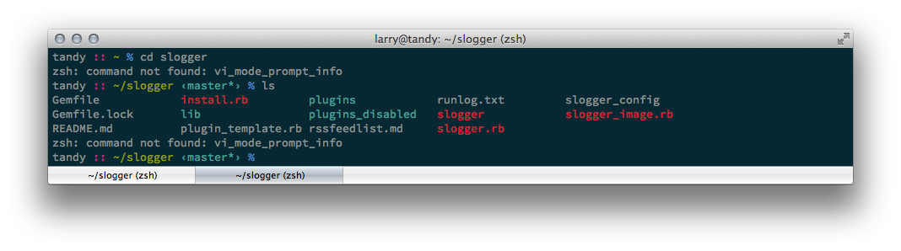
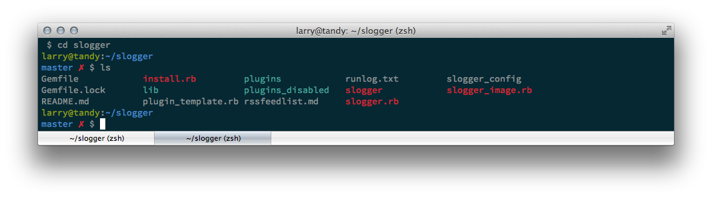

oh-my-zsh-themes
================

Images to make your theme choice easier.

Up to date as of 29 Sept. 2013, you can view examples of all the themes currently available for the very lovely [oh-my-zsh](https://github.com/robbyrussell/oh-my-zsh). I had no part in the creation of any of these themes, I'm just presenting them here for reference if you want to see what's available to you.

Images are from iTerm2 on OSX using the [Solarized](https://github.com/altercation/solarized) dark colour scheme.

## 3den

## adben

## af-magic

## afowler

## agnoster

Despite my best efforts I can't get the patched fonts for vim-powerline to work correctly with agnoster, so it is not showing the correct symbols here. Apologies.

## alanpeabody

## apple

## arrow

## aussiegeek

## avit

## awesomepanda

## bira

## blinks

## candy-kingdom

## candy

## clean

## cloud

## crcandy

## crunch

## cypher

## dallas

## darkblood

## daveverwer

## dieter

## dogenpunk

## dpoggi

## dst

## dstufft

## duellj

## eastwood

## edvardm

## essembeh

## evan

## example

## fino_time

## fino

## fishy

## flazz

## fletcherm

## fox

## frisk

## frontcube

## funky

## fwalch

## gallifrey

## gallois

## garyblessington

## gentoo

## geoffgarside

## gianu

## gnzh

## gozilla

## half-life

## humza

## imajes

## intheloop

## itchy

## jaischeema

## jbergantine

## jispwoso

## jnrowe

## jonathan

## josh

## jreese

## jtriley

## juanghurtado

## junkfood

## kafeitu

## kardan

## kennethreitz

## kiwi

## kolo

## kphoen

## lambda

## lukerandall

## macovsky

## maran

## mgutz

## mh

## michelebologna

## mikeh

## miloshadzic

## minimal

## mortalscumbag

## mrtazz

## murilasso

## muse

## nanotech

## nebirhos

## nicoulaj

## norm

## obraun

## philips

## pmcgee

## pygmalion

## re5et

## rgm

## risto

## rixius

## rkj-repos

## rkj

## robbyrussell

## sammy

## simonoff

## simple

## skaro

## smt

## Soliah

## sorin

## sporty_256

## steeef

## sunaku

## sunrise

## superjarin

## suvash

##  takashiyoshida

## terminalparty

## theunraveler

## tjkirch_mod

## tjkirch

## tonotdo

## trapd00r

## wedisagree

## wezm

## wezm+

## wuffers

## xiong-chiamiov-plus

## xiong-chiamiov

## ys

## zhann

